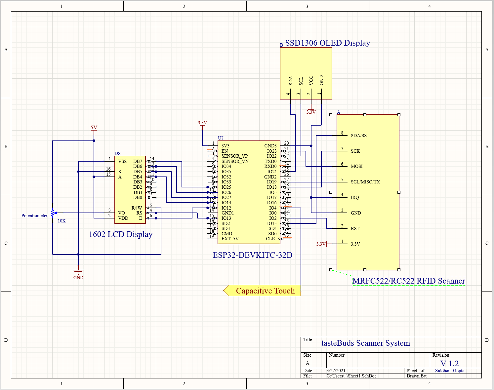
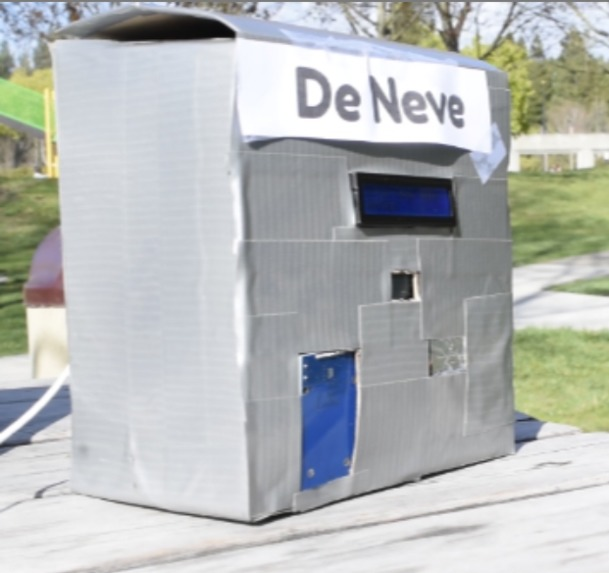

# TasteBuds - LA Hacks 2021 Submission
#### Modernizing Dining Halls, One Swipe At a Time

Looking forward to eating your next meal but don’t know which dining hall to grab a bite with your friends? Want to go to a dining hall with no wait? Then Tastebuds is the all in one IoT system for you! 

Watch how TasteBuds works here: https://youtu.be/ZMz_4wQKs1w

Visit our Devpost: https://devpost.com/software/tastebuds

## The Big Picture

**TasteBuds is a product designed to augment the existing student ID swipe system at university dining halls.**

Our inspiration for this project came from countless UCLA upperclassmen remarking that the current capacity system for UCLA dining halls is *clunky, hard to navigate, and fails to update in real time*. With our hardware, app, and realtime database, we address *all* of these issues through an intuitive overview of dining hall information.

Although many college campuses have some form of capacity tracking or menu information, they often lack other features that our system provides. By including a friend list showcasing where your friends currently are (if they opted in to share their location), we allow for greater connectivity, which will be vital for newer students. Furthermore, we also integrated the standard capacity tracking, menu items, and hours of operation, providing a one stop destination for hungry students.

## Schematic & App Flow

#### List of Features

- Account authentication with google
- RFID scanner and QR code generation
- Friends list with QR code pairing
- Logout button
- Opt-in to share location with friends
- List of dining halls with current friends inside of them
- Real time capacity and activity levels of each dining hall
- Dining hall open hours
- Daily Menu of each dining hall per mealtime
- Recipe and nutrition information of each menu item

#### App Flow

#### Hardware Schematic

When a user swipes in, our system reads their ID card via an RFID scanner. Then the user scans a QR code generated on the OLED display to pair their bruin card with their TasteBuds profile . After successfully pairing the account, the user simply taps on a piece of foil, and through capacitive touch sensing, the QR code is cleared, preventing others from accessing sensitive RFID information. The information is pushed by the ESP32 system to our database.

## Technology

#### List of technologies used

**Software:**
- React Native Expo (iOS & Android)
- Firebase Realtime Database
- Google Cloud Scheduler & Pub/Sub Asynchronous Communication
- Web Scraping
- QR code generation and scanning
- Javascript, Python, and HTML/CSS
- Figma

**Hardware:**
- Wifi-enabled ESP-32 microcontroller
- Capacitive Sensing
- RFID Scanner
- LCD/OLED Display
- Coded through Arduino IDE

#### Challenges & Roadblocks

**On the software side we had to learn a ton of new technologies.** For a lot of the developers it was their first time using React Native, Expo, and Firebase. It was also our first time web-scraping in Python and automating tasks with the Google Cloud Platform. Receiving and updating changes in the database in real time was challenging due to the asynchronous nature of Javascript. For the daily menu, we also had difficulties web scraping UCLA’s closed dining hall pages that we revived using the Wayback Machine.

**On the hardware side, we had to figure out how to integrate all the different components into one cohesive system.** From the Esp32 handling communication to the database to the multiple screens and sensors that interacted with the user, we had to effectively plan out the interactions between each module. Communication between the database and hardware was especially challenging since it required rapid reads and writes at multiple stages of the swipe-in process. 

**The biggest problem we faced was the difficulty in scanning the QR code displayed on the OLED.** Unfortunately, the refresh rate of the OLED display interfered with the camera shutter speed such that there were rolling black bars that sometimes made scanning difficult. However, when we discovered this issue, it was too late to obtain a new display, but we were able to find some success in inverting the screen colors. In the future, we would likely try to obtain an OLED that has adjustable refresh rates. 

## Future Opportunities

RFID tags are encrypted, so by having access to UCLA’s Bruin Card Database, which has the association between the RFID tags and user ID’s,  we would be able to pair users together when they create their TasteBuds account, alleviating our OLED display quirk. Users would simply scan their barcode on the back of their ID card using the app to quickly pair their card to their TasteBuds profile.

A significant advantage of TasteBuds is that the functionality is not limited to dining halls at UCLA. With very slight adjustments, we could easily implement a system that works for any college, allowing for rapid expansion. 

**With TasteBuds, we hope to create not only a more informed, but also a more connected dining experience.**
